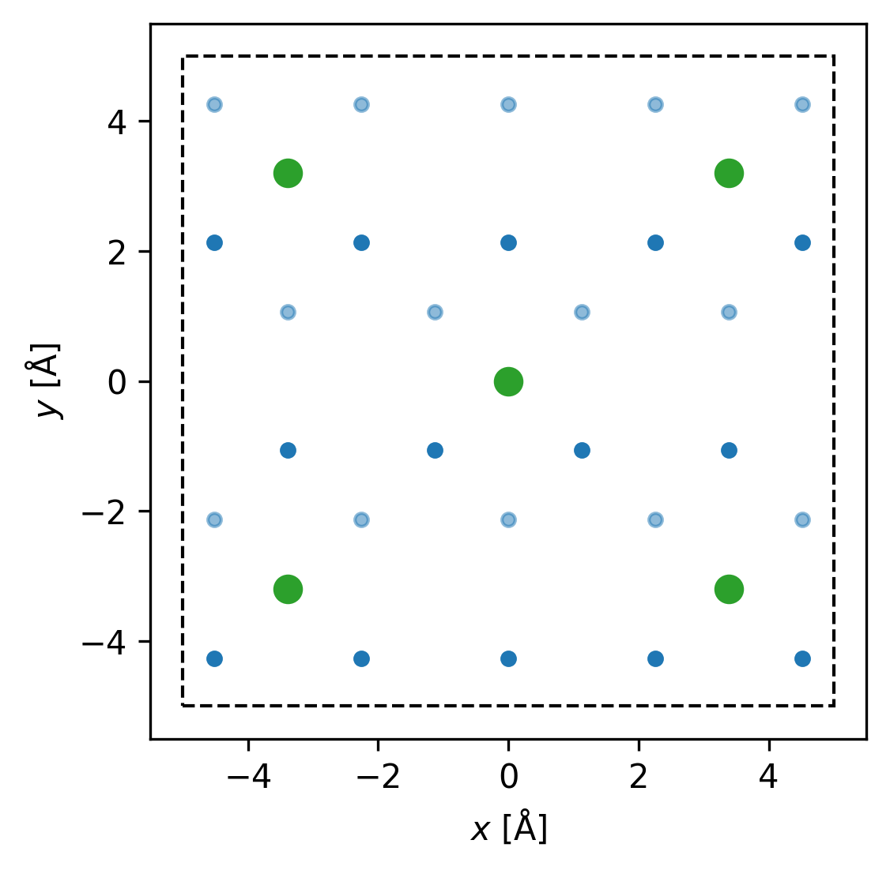
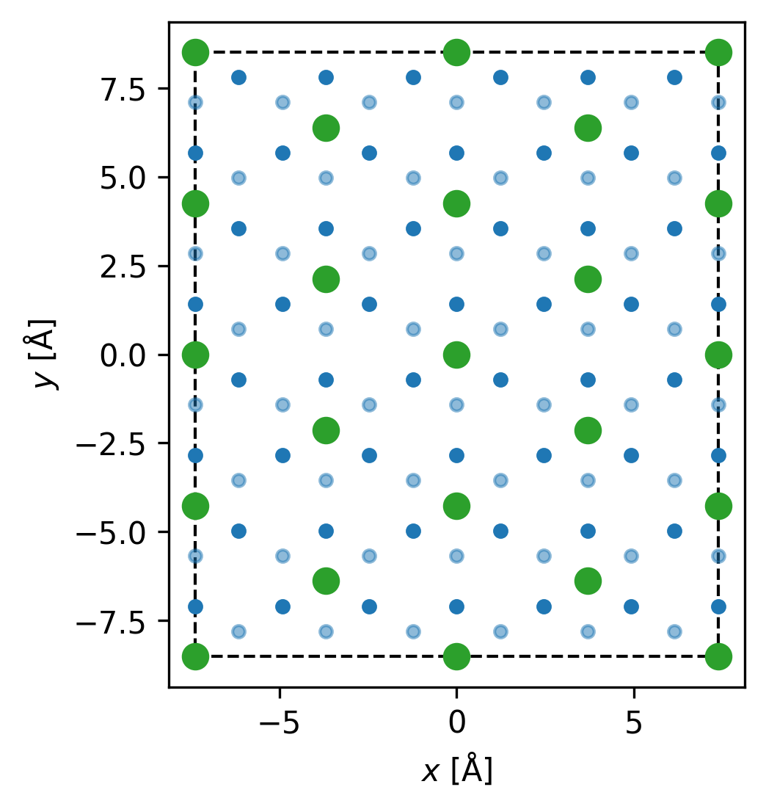
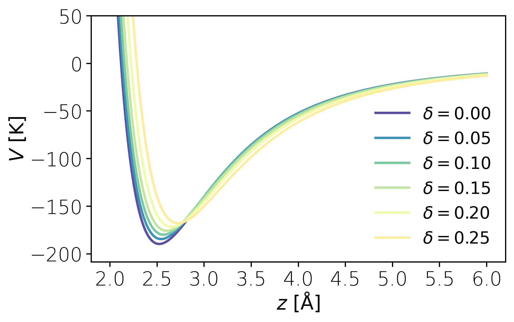
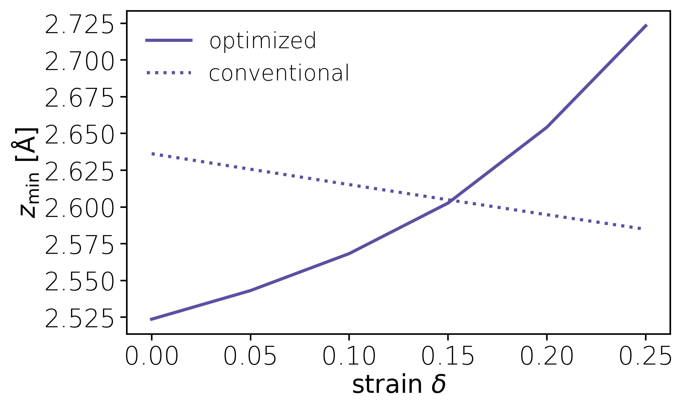
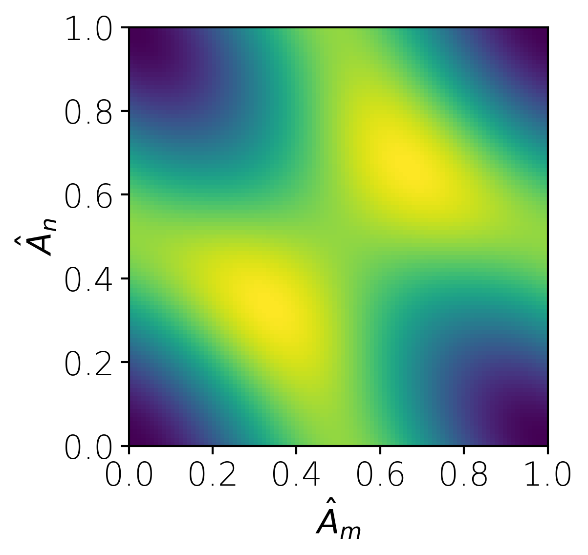
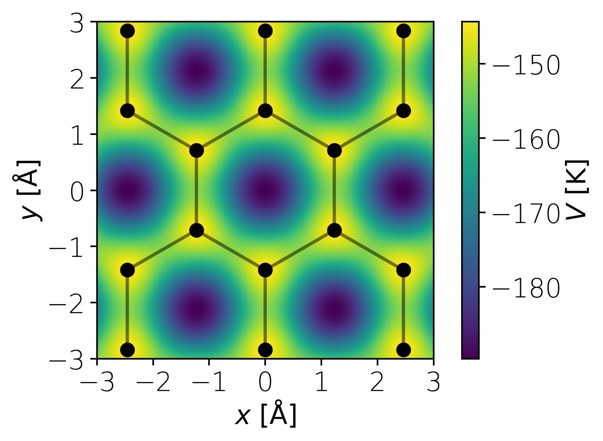

# Graphene Tools
A set of tools to generate the interaction of helium with uniaxially strained graphene (in the armchair direction) using optimized Lennard-Jones parameters from [Nichols et al.](https://doi.org/10.1103/PhysRevB.93.205412) and to print command line parameters for use with quantum Monte Carlo (QMC) software located at [code.delmaestro.org](https://code.delmaestro.org). Code to generate figures for 1D and 2D potential interactions included as well. Please cite the origial paper as:

```text.bibtex
@article{Nichols2016,
  title = {Adsorption by design: Tuning atom-graphene van der Waals interactions via mechanical strain},
  author = {Nichols, Nathan S. and Del Maestro, Adrian and Wexler, Carlos and Kotov, Valeri N.},
  journal = {Phys. Rev. B},
  volume = {93},
  issue = {20},
  pages = {205412},
  numpages = {14},
  year = {2016},
  month = {May},
  publisher = {American Physical Society},
  doi = {10.1103/PhysRevB.93.205412},
  url = {https://link.aps.org/doi/10.1103/PhysRevB.93.205412}
}
```

## Installation
You can install Graphene Tools from [PyPI](https://pypi.org/project/graphenetools-py/):
```
pip install graphenetools-py
```

## How to use
Some command line tools have been included for convenience. Avaiable options are dermined by:
```
python -m graphenetools
```
For example, to run the listed command to print the parameters corresponding to a roughtly square box commensurate with the $C_{1/3}$ phase with strain $\delta=0.25$ and 100 adsorption sites use:
```
python -m gt_rs 5 --strain 0.25
```

## Advanced usage
Better usage of the Graphene Tools package can be achieved by importing the pacakge directly into your project or notebook environment using `import graphenetools as gt`. Some advanced usage cases are discussed below.

<a id='lattice_vectors'></a>
### Lattice vectors
Generate basis, lattice, and reciprocal lattice vectors for uniaxially strained graphene.


```python
strain = 0.50 # Strain value in armchair direction
Am, An, b1, b2, gm, gn = gt.get_graphene_vectors(strain)
```

$C_{1/3}$ phase lattice vectors can be generated too!


```python
strain = 0.50 # Strain value in armchair direction
Am_c_one_third, An_c_one_third = gt.get_graphene_c_one_third_vectors(strain)
```

<a id='plot_lattice'></a>
# Plot lattice
Plots of the graphene lattice can be made using the `plot_graphene_lattice()` function.


```python
# Here we plot a funky box
box_dims = [-2.0,6.0,-3.0,8.0]
strain = 0.50
fig, ax = gt.plot_graphene_lattice(strain,box_dims)
fig.set_dpi(300)
```


Additionally, the $C_{1/3}$ phase locations can be plotted along with the graphene lattice using the `plot_graphene_lattice_with_c_one_third()` function.


```python
# If given a single float or int box dims is [-box_dims/2,box_dims/2,-box_dims/2,box_dims/2]
# Here we plot the graphene lattice and C1/3 adsorption sites
box_dims = 10
strain = 0.50
fig, ax = gt.plot_graphene_lattice_with_c_one_third(strain,box_dims)
fig.set_dpi(300)
```





<a id='generate_qmc_parameters'></a>
# Generate QMC parameters
Simulation parameters to produce a roughly square simulation cell commensurate with the $C_{1/3}$ phase for use with QMC software hosted at [code.delmaestro.org](https://code.delmaestro.org) can be generated using the `roughly_square()` function and a plot of simulation cell generated using the `roughly_square_plot()` function.


```python
# Here we plot roughly square plots commensurate with the C1/3 adsorption sites and print out the relevant PIMC parameters
strain = 0.00
n=2 # `(2n)^2` C1/3 adsorption sites
fig, ax = gt.roughly_square_plot(n,strain)
gt.roughly_square(n,strain) #print out the relevant PIMC parameters
fig.set_dpi(300)
```

    -N 16 --Lx 14.757072880486835 --Ly 17.04





For non-"roughly square" command line parameters and plots use functions `c_one_third_commensurate_command()` and `c_one_third_commensurate_command_plot()`.


```python
# Here we plot a mostly rectangular plot commensurate with the C1/3 adsorption sites and print out the relevant PIMC parameters
strain = 0.00
m=3
n=1
fig, ax = gt.c_one_third_commensurate_command_plot(m,n,strain)
gt.c_one_third_commensurate_command(m,n,strain) #print out the relevant PIMC parameters
fig.set_dpi(300)
```

    -N 6 --Lx 22.135609320730254 --Ly 4.26


<a id='generate_potential_plots'></a>
### Generate potential plots
The potential can also be calculated for the helium-graphene interaction using Graphene Tools. Here are some demonstrations at various strains.

#### 0D potential plot (a single point)
The potential can be generate at a single point using the `V_64()` function. Optimized parameters to the Lennard-Jones potential are obtained using the `get_LJ_parameters()` function.


```python
# Get optimized Lennard-Jones parameters for certain strain
strain = 0.00
conventional=True # Setting conventional to true will return the conventional parameters
sigma, epsilon = gt.get_LJ_parameters(strain,conventional=conventional)
_x = 0.00
_y = 0.00
_z = 3.00

#Generate helium-graphene interaction potential for a single point
carbon_carbon_distance=1.42
poisson_ratio=0.165
k_max=10000
potential="V" # can also generate the gradient or Laplacian by setting this variable to gradVx, gradVy, gradVz, or grad2V
gt.V_64(strain, sigma, epsilon, _x, _y, _z, carbon_carbon_distance=carbon_carbon_distance, poisson_ratio=poisson_ratio, k_max=k_max,potential=potential)
```


    -158.92622261112095


#### 1D potential plot
Here a 1D potential for a helium atom located above the graphene sheet is generated using the `generate_V1D()`. Note that the graphene sheets are centered on the center of the hexgonal unit (not centered on a carbon atom).


```python
# Generate a 1D potential along z-direction at specific (x,y) location
strain = 0.00
x = 0.0
y = 0.0
z = gt.np.linspace(2.0,15.0,1001)
V = gt.generate_V1D(x,y,z,strain=strain) #Using default arguments (check function for extensive list)
    
```

Plots for multiple values of strain can be generated using the `plot_V1D()` function.


```python
x = 0.00
y = 0.00
z = gt.np.linspace(2,6,1001)
dpi = 300
strains = gt.np.linspace(0,.25,6)
mplstylefile = "./include/notebook.mplstyle"
fig, ax, V_array = gt.plot_V1D(x,y,z,strains=strains,mplstylefile=mplstylefile,dpi=dpi)
fig.savefig("V1D_optimized_close.png",bbox_inches="tight")
```





##### Minimum of 1D potential
The minimum location and value of the potential for the different strain values can be determined using the `get_z_min()` and `get_z_mins()` functions.


```python
# Get minimum potential and location above graphene sheet for a single strain value
strain = 0.00
z_min, V_min = gt.get_z_min(strain)

# Get minimum potential and location above graphene sheet for multiple strains
strains = gt.np.linspace(0,.25,6)

z_mins, V_mins = gt.get_z_mins(strains)
z_mins_conventional, V_mins_conventional = gt.get_z_mins(strains,conventional=True)
```

Note the different behavior when using the optmized parameters from [Nichols et al.] compared with using the conventional parameters.


```python
#Plot z
mplstylefile = 'default'
with gt.plt.style.context(mplstylefile):
    fig, ax = gt.plt.subplots(dpi=300)
    ax.plot(strains,z_mins,label="optimized")
    ax.set_prop_cycle(None)
    ax.plot(strains,z_mins_conventional,linestyle=":",label=r"conventional")
    ax.set_xlabel(r"$\mathrm{strain}\ \delta$")
    ax.set_ylabel(r"$z_\mathrm{min}\ \mathrm{[\AA]}$")
    ax.legend()
    fig.savefig("zmin.png")
```





#### 2D potential plot
Here a 2D potential lookup table for a helium atom located above the graphene sheet is generated over the unit cell using the `generate_V2D_uc()`.


```python
strain = 0.00
resolution = 101
fn_prefix="./helium-graphene-2D-unit-cell"
z_min, V_min = gt.get_z_min(strain)

# Generate 2D lookup table on the unit cell for 
data = gt.generate_V2D_uc(z_min, strain=strain, resolution=resolution, fn_prefix="./helium-graphene-2D-unit-cell")
```

Here is a visualization of the 2D lookup table.


```python
fn = "helium-graphene-2D-unit-cell-conventional_V_strain_0.00000_z_2.63624_res_101.npz"
data = gt.np.load(fn)
mplstylefile = 'default'
with gt.plt.style.context(mplstylefile):
    fig,ax = gt.plt.subplots(dpi=300)
    ax.imshow(data["potential"].T,origin="lower",extent=[0,1,0,1])
    ax.set_xlabel(r"$\hat{A}_m$")
    ax.set_ylabel(r"$\hat{A}_n$")
```





The 2D potential interaction on the Cartesian plan is generated using the `get_V2D()` function and takes the generated 2D lookup table as a parameter. Plots of the 2D potential can be generated using `plot_V2D()` with the option to include the graphene lattice.


```python
# Here we generate 2D potential data on the Cartesian plane by using a generated lookup table
box_dims = gt.np.array([-3.0,3.0,-3.0,3.0])
resolution = 201
fn = "helium-graphene-2D-unit-cell_V_strain_0.00000_z_2.52369_res_101.npz"
big_V, big_xy_x, big_xy_y, extent = gt.get_V2D(fn,box_dims,resolution=resolution)
V2D_data = (big_V, big_xy_x, big_xy_y, extent)

# and plot the data we just generated
dpi = 300
plot_filename="V2D.png" # save plot as this name
mplstylefile = 'default'
fig_ax = None
graphene_lattice = True # include the graphene lattice
try:
    fig, ax, V2D_data = gt.plot_V2D(fn,box_dims,V2D_data=V2D_data,plot_filename=plot_filename,mplstylefile=mplstylefile,resolution=resolution,dpi=dpi)
except:
    fig, ax, V2D_data = gt.plot_V2D(fn,box_dims,plot_filename=plot_filename,mplstylefile=mplstylefile,resolution=resolution,dpi=dpi)

```





#### 3D potential plot (still a 2D slice)
Similar to the 2D methods a 3D plot of the 2D potential slice can be generated using `plot_V3D()`.


```python
# Here we generate 2D potential data on the Cartesian plane by using a generated lookup table
box_dims = gt.np.array([-3.0,3.0,-3.0,3.0])
resolution = 201
fn = "helium-graphene-2D-unit-cell_V_strain_0.00000_z_2.52369_res_101.npz"
big_V, big_xy_x, big_xy_y, extent = gt.get_V2D(fn,box_dims,resolution=resolution)
V2D_data = (big_V, big_xy_x, big_xy_y, extent)

# and plot the data we just generated
figsize = (16,9) # widescreen!
dpi = 240 # dpi corresponds to 4K image
plot_filename="V3D.png"
mplstylefile = 'default'
fig_ax = None
graphene_lattice = True
surf_kwargs={"alpha":0.5,"cmap":"viridis"}
try:
    fig, ax, V2D_data = gt.plot_V3D(fn,box_dims,plot_filename=plot_filename,V2D_data=V2D_data,mplstylefile=mplstylefile,resolution=resolution,dpi=dpi,figsize=figsize,surf_kwargs=surf_kwargs)
except:
    fig, ax, V2D_data = gt.plot_V3D(fn,box_dims,plot_filename=plot_filename,mplstylefile=mplstylefile,resolution=resolution,dpi=dpi,figsize=figsize,surf_kwargs=surf_kwargs)


```


#### Additional usage
See function documentation to discover additional usage.
